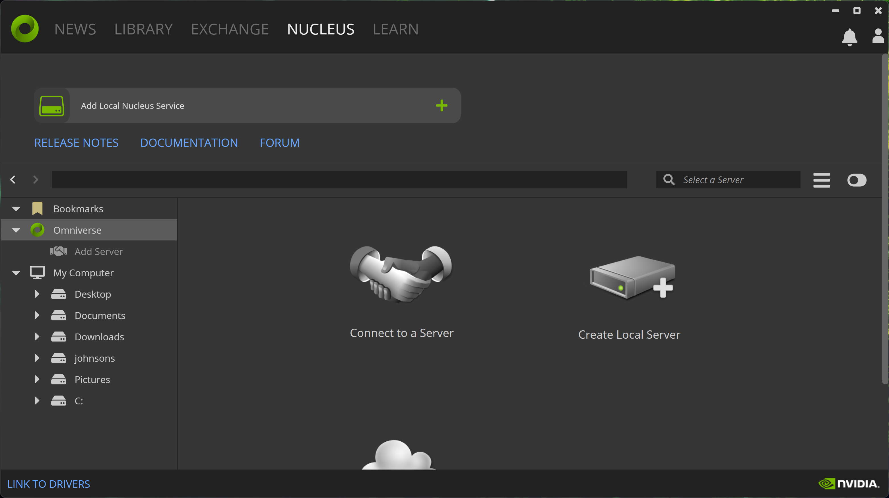
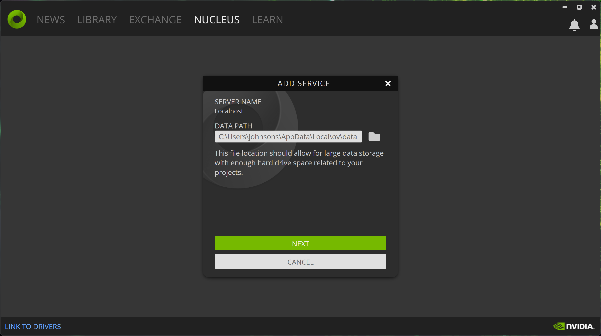
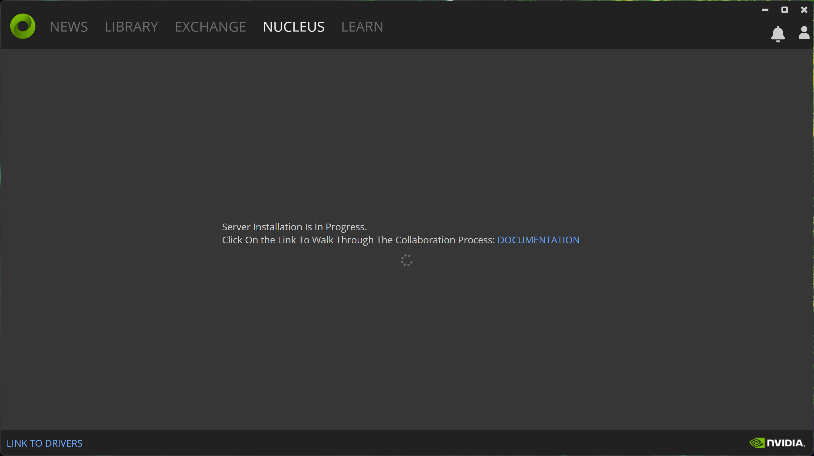
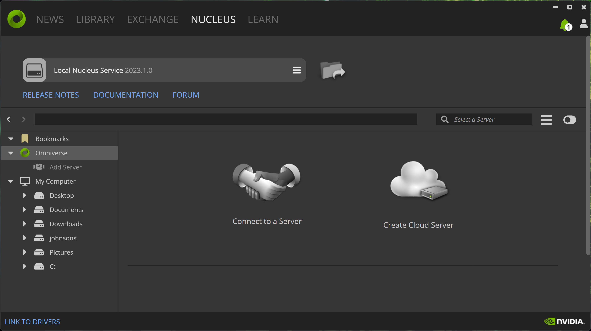
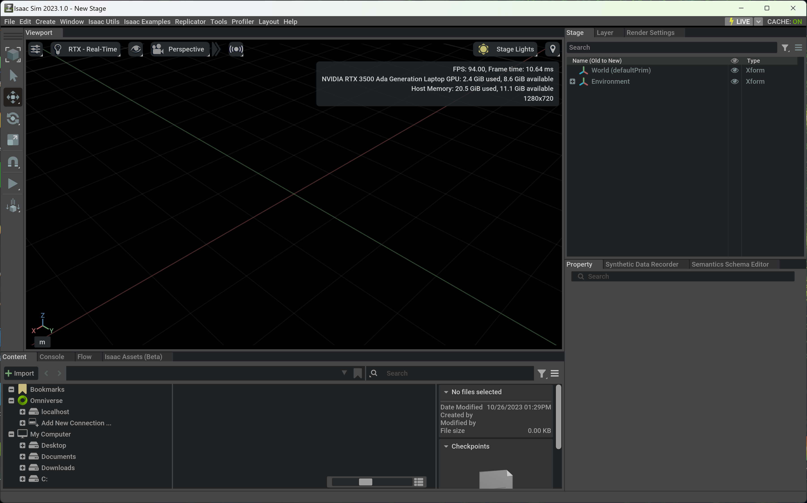
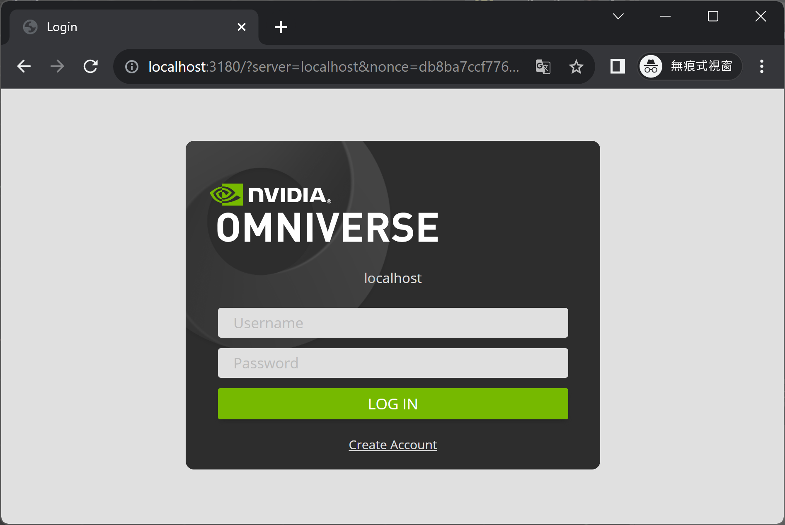
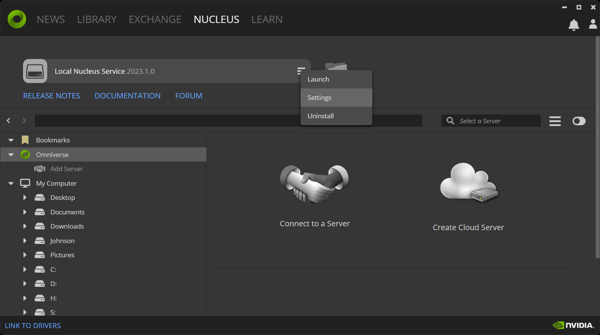
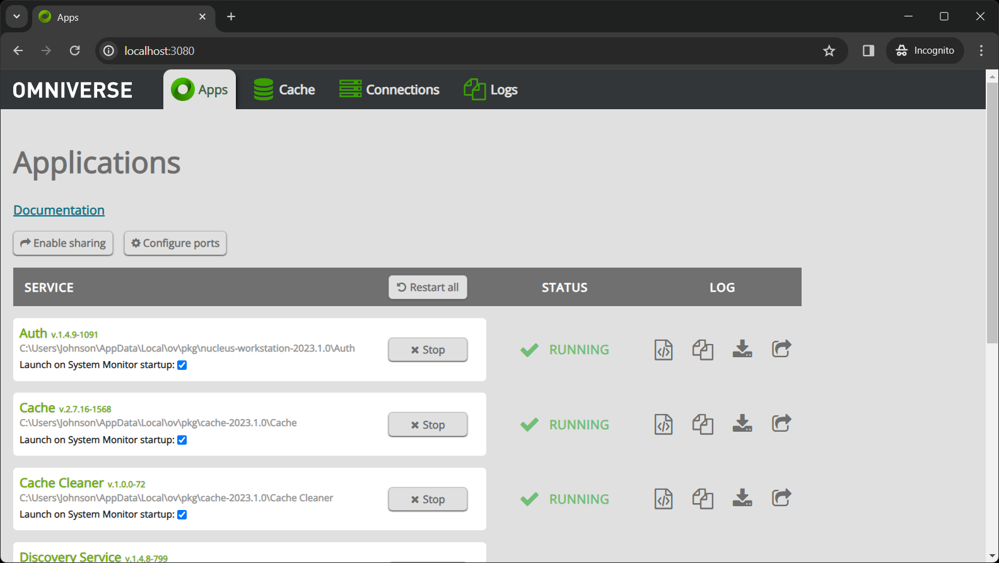
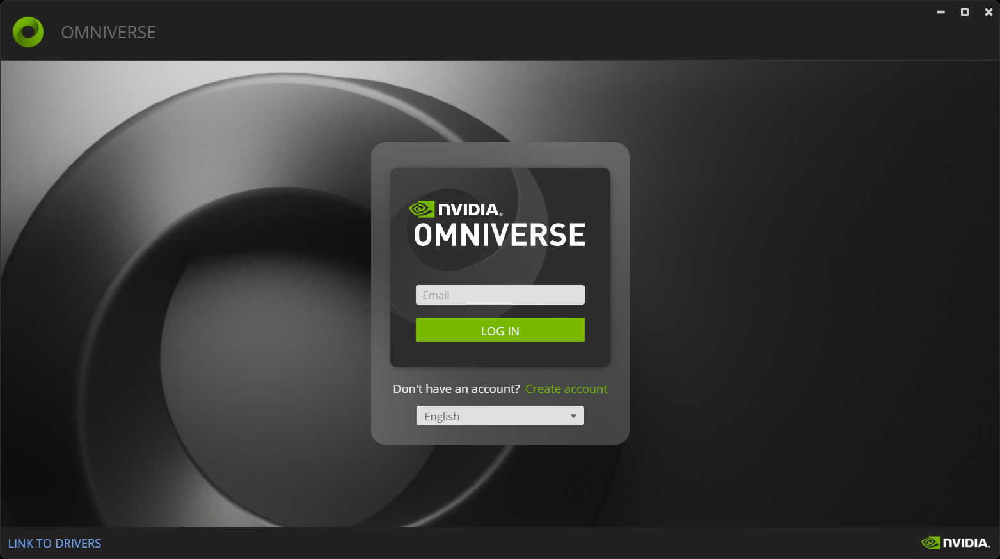

# Isaac Extended

Some examples, notes, and patches not yet included in the latest Isaac release.

The description of each Isaac components can be found in the [j3soon/nvidia-isaac-summary](https://github.com/j3soon/nvidia-isaac-summary) repo.

## Set up

```sh
git clone https://github.com/j3soon/isaac-extended.git
cd isaac-extended
```

The following will assume you have cloned the directory and `cd` into it:

## Isaac Sim

### Conda issue on Linux

Reference: <https://docs.omniverse.nvidia.com/isaacsim/latest/installation/install_python.html#advanced-running-with-anaconda>

Bug reports:

- [#3752249](https://github.com/j3soon/nvbugs/blob/master/3752249.md)

Solutions:

- Isaac Sim 2022.1.1
  ```sh
  export ISAAC_SIM="$HOME/.local/share/ov/pkg/isaac_sim-2022.1.1"
  cp $ISAAC_SIM/setup_python_env.sh $ISAAC_SIM/setup_python_env.sh.bak
  cp ./isaac_sim-2022.1.1-patch/linux/setup_python_env.sh $ISAAC_SIM/setup_python_env.sh
  ```
- Isaac Sim 2022.2.0
  ```sh
  export ISAAC_SIM="$HOME/.local/share/ov/pkg/isaac_sim-2022.2.0"
  cp $ISAAC_SIM/setup_python_env.sh $ISAAC_SIM/setup_python_env.sh.bak
  cp ./isaac_sim-2022.2.0-patch/linux/setup_python_env.sh $ISAAC_SIM/setup_python_env.sh
  ```
- Isaac Sim 2022.2.1
  ```sh
  export ISAAC_SIM="$HOME/.local/share/ov/pkg/isaac_sim-2022.2.1"
  cp $ISAAC_SIM/setup_python_env.sh $ISAAC_SIM/setup_python_env.sh.bak
  cp ./isaac_sim-2022.2.1-patch/linux/setup_python_env.sh $ISAAC_SIM/setup_python_env.sh
  ```
- Isaac Sim 2023.1.0
  ```sh
  export ISAAC_SIM="$HOME/.local/share/ov/pkg/isaac_sim-2023.1.0"
  cp $ISAAC_SIM/setup_python_env.sh $ISAAC_SIM/setup_python_env.sh.bak
  cp ./isaac_sim-2023.1.0-patch/linux/setup_python_env.sh $ISAAC_SIM/setup_python_env.sh
  ```

### Conda issue on Windows

Bug reports:

- [#3837533](https://github.com/j3soon/nvbugs/blob/master/3837533.md)
- [#3837573](https://github.com/j3soon/nvbugs/blob/master/3837573.md)
- [#3837658](https://github.com/j3soon/nvbugs/blob/master/3837658.md)

Solutions:

- Isaac Sim 2022.1.1
  ```sh
  set ISAAC_SIM="%LOCALAPPDATA%\ov\pkg\isaac_sim-2022.1.1"
  copy .\isaac_sim-2022.1.1-patch\windows\setup_conda_env.bat %ISAAC_SIM%\setup_conda_env.bat
  ```
  and make sure to run the following after activating the conda environment:
  ```sh
  call setup_conda_env.bat
  ```
- If you need a patch for other Isaac Sim versions, please [open an issue](https://github.com/j3soon/isaac-extended/issues).
- For other package version issues, please refer to the bug reports.

### Docker Container issue

Bug reports:

- [#4063971](https://github.com/j3soon/nvbugs/blob/master/4063971.md)

Solution:

- Run the following command immediately after starting a `nvcr.io/nvidia/isaac-sim:2022.2.1` container:
  ```sh
  rm /etc/vulkan/icd.d/nvidia_icd.json
  ```

### Docker Container with Display

Reference: <https://docs.omniverse.nvidia.com/isaacsim/latest/installation/install_container.html>

The original docker command is:

```sh
docker run --name isaac-sim --entrypoint bash -it --gpus all -e "ACCEPT_EULA=Y" --rm --network=host \
  -e "PRIVACY_CONSENT=Y" \
  -v ~/docker/isaac-sim/cache/kit:/isaac-sim/kit/cache:rw \
  -v ~/docker/isaac-sim/cache/ov:/root/.cache/ov:rw \
  -v ~/docker/isaac-sim/cache/pip:/root/.cache/pip:rw \
  -v ~/docker/isaac-sim/cache/glcache:/root/.cache/nvidia/GLCache:rw \
  -v ~/docker/isaac-sim/cache/computecache:/root/.nv/ComputeCache:rw \
  -v ~/docker/isaac-sim/logs:/root/.nvidia-omniverse/logs:rw \
  -v ~/docker/isaac-sim/data:/root/.local/share/ov/data:rw \
  -v ~/docker/isaac-sim/documents:/root/Documents:rw \
  nvcr.io/nvidia/isaac-sim:2023.1.1
```

The modified docker command with display is:

```sh
xhost +local:docker
docker run --name isaac-sim --entrypoint bash -it --gpus all -e "ACCEPT_EULA=Y" --rm --network=host \
  -e "PRIVACY_CONSENT=Y" \
  -v ~/docker/isaac-sim/cache/kit:/isaac-sim/kit/cache:rw \
  -v ~/docker/isaac-sim/cache/ov:/root/.cache/ov:rw \
  -v ~/docker/isaac-sim/cache/pip:/root/.cache/pip:rw \
  -v ~/docker/isaac-sim/cache/glcache:/root/.cache/nvidia/GLCache:rw \
  -v ~/docker/isaac-sim/cache/computecache:/root/.nv/ComputeCache:rw \
  -v ~/docker/isaac-sim/logs:/root/.nvidia-omniverse/logs:rw \
  -v ~/docker/isaac-sim/data:/root/.local/share/ov/data:rw \
  -v ~/docker/isaac-sim/documents:/root/Documents:rw \
  -v $(pwd):/workspace \
  -v /tmp/.X11-unix:/tmp/.X11-unix \
  -e DISPLAY=$DISPLAY \
  nvcr.io/nvidia/isaac-sim:2023.1.1
```

and run `/isaac-sim/runapp.sh` inside the container to start Isaac Sim.

### Minors

Bug reports:

- [#4035662](https://github.com/j3soon/nvbugs/blob/master/4035662.md)

## Nucleus

### Installation

Many users often forget to install Nucleus before running Isaac Sim examples.

Please follow [the official installation instructions](https://docs.omniverse.nvidia.com/nucleus/latest/workstation/installation.html#install-using-omniverse-launcher) carefully.

Or follow our installation guide below:

1. Open Omniverse Launcher, go to the `Nucleus` tab, and click `Add Local Nucleus Service`.

   

2. Use the default `DATA PATH` and click `NEXT`.

   

3. Create a local admin account for Nucleus by filling out the form and click `COMPLETE SETUP`.

   

4. Wait for the installation to finish.

   

5. Confirm that `Local Nucleus Service` is displayed instead of the original `Add Local Nucleus Service`, indicating that the installation is successful.

   

6. Launch Isaac Sim and click `Content > Omniverse > localhost` in the bottom tab.

   

7. You should see a hint to login from your web browser.

   

8. A new tab should be opened in your web browser. Login with the account you created in step 3.

   

   If you have trouble logging in, simply create a new account by clicking `Create Account`.

   

9. After logging in, you should see the following page. You can close the tab now.

   

10. Go back to Isaac Sim and click `Content > Omniverse > localhost` again. You should see the built-in folders (`Library`, `NVIDIA`, `Projects`, `Users`).

    

### Troubleshooting

In some cases, Nucleus may not be running properly. You can check the status of the Nucleus process by visiting the `Settings` page of Nucleus:

1. Go to the Nucleus tab and click `Settings`.

   

2. A new tab should be opened in your web browser. Visit the `Apps` tab and make sure that all Apps are currently running. If not, click `Restart all` to start them. If your disk is almost full, you may want to visit the `Cache` tab and clear the cache.

   

3. Open Isaac Sim and click `Content > Omniverse > localhost`, Nucleus may ask you to login. After that, you should see the built-in folders (`Library`, `NVIDIA`, `Projects`, `Users`).

   

4. As a side note, you may also need to re-login to the Omniverse Launcher after some time.

   

## Isaac ROS

### isaac_ros_common issue

Bug reports:

- [#4113333](https://github.com/j3soon/nvbugs/blob/master/4113333.md)

Solution:

- Change repo remote to <https://github.com/j3soon/isaac_ros_common> and reset to remote HEAD.

### Jetson Board Setup

- Make sure to flash the supported Jetpack version: <https://github.com/NVIDIA-ISAAC-ROS/.github/blob/main/profile/hardware-setup.md>.
- A large enough MicroSD Card seem to be able to replace the NVMe SSD card mentioned here: <https://github.com/NVIDIA-ISAAC-ROS/isaac_ros_common/blob/main/docs/dev-env-setup_jetson.md>.
